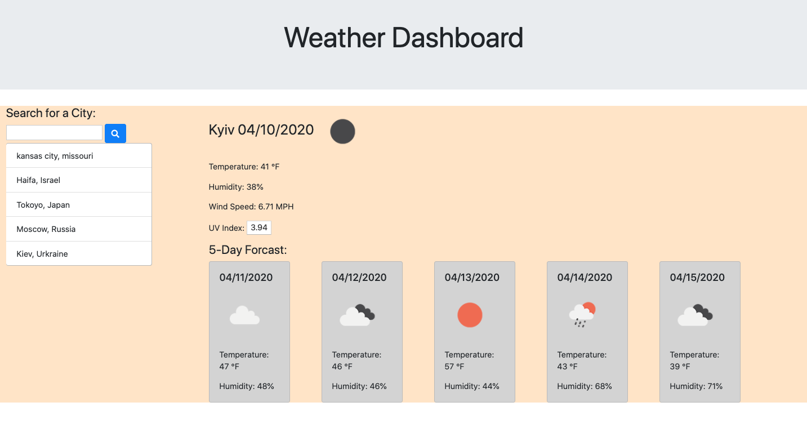

# Weather Dashboard

## Description
A web application that searches the weather of 200,000 locations in the world. Making a call to Open Weather API rendering data to the document object model using JQUERY, Javascript, HTML, and CSS

## Technologies

* Javascript
* HTML
* JQuery 
* Open Weather API

## Weather API App

## User Story
AS A User I want see the weather of my desired location, displayed an accessible web page, 
SO I know how to prepare and plan a trip there accordingly.

## Business Context
It becomes very frustrating, costly, and can become time consuming if one is not prepared for the weather in a new location. When planing for travel, knowing the weather ahead of time helps onself to prepare by packing the appropriate attire and protections for self and equipment. 

